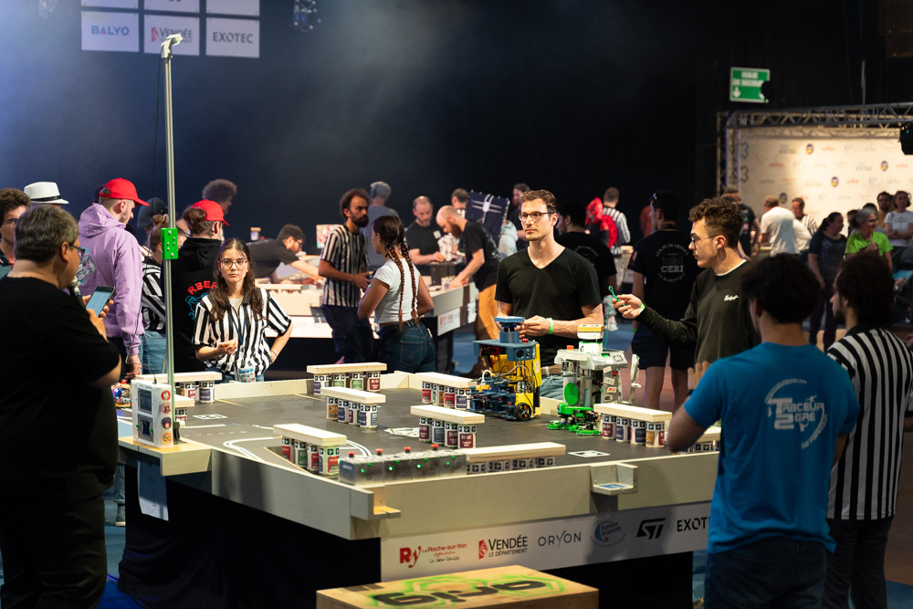
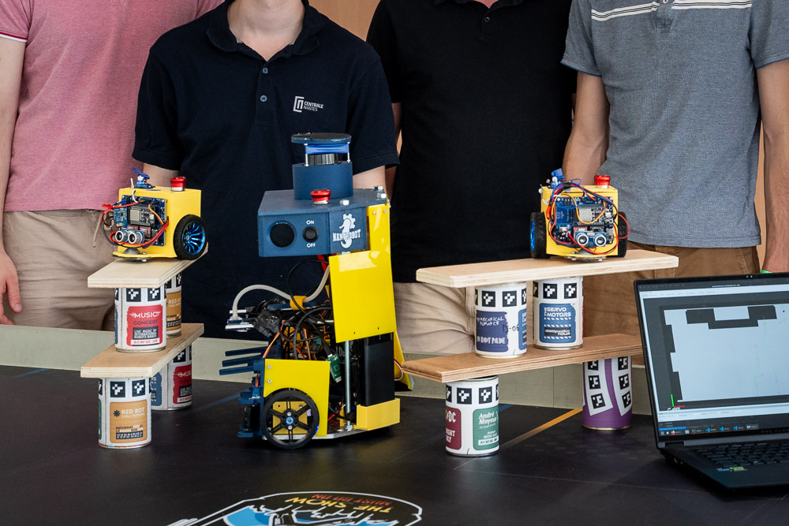
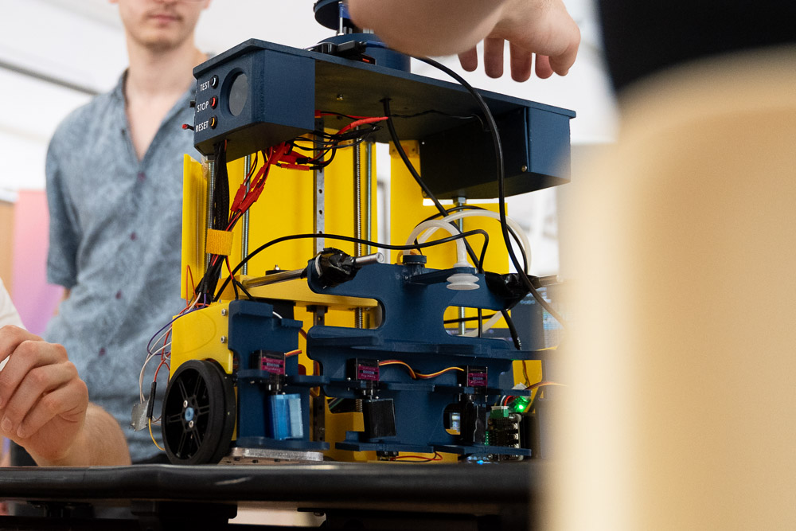
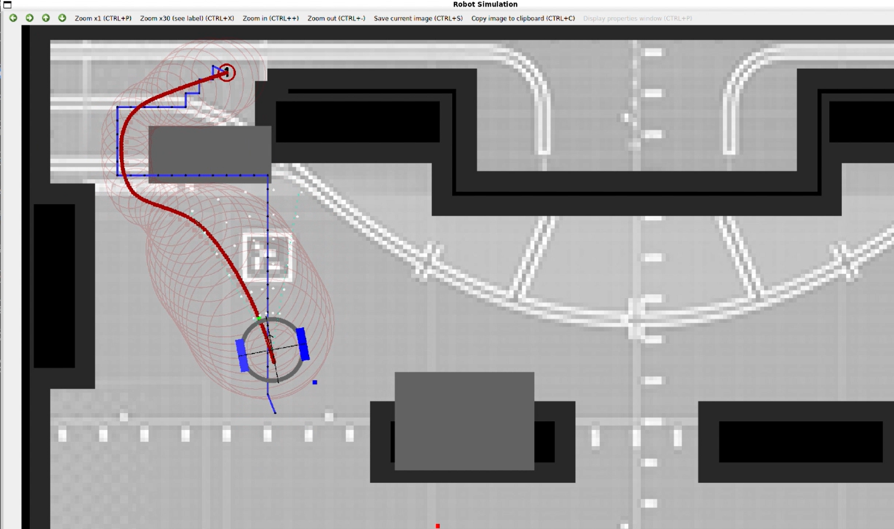

<<<<<<< HEAD
# 🤖 2024–2025 Eurobot France Robot (ROS 2 + ESP32)

<p align="center">

</p>

This repository contains the software used for our **Eurobot France 2025** mobile robot.

Competition objective (software side):
- move safely on the table,
- pick up cans,
- move them to scoring zones,
- and stack them with a wooden plank,
while coordinating high-level autonomy (Raspberry Pi + ROS2) and low-level actuation (ESP32).

---


## ⚡ Quick Summary (TL;DR)

- This repository is the full competition software stack for our **Eurobot France 2025** robot, split between high-level ROS2 autonomy on the Raspberry Pi and real-time actuator control on the ESP32.
- The robot mission flow is: navigate the table, pick cans, transport them, and stack them according to ordered match goals defined in YAML strategies (blue/yellow team variants).
- On the ROS2 side, `main_node` coordinates mission sequencing, ESP synchronization, and runtime state progression, while `laser_to_pointcloud_node` converts LiDAR scans into map-frame pointcloud data.
- Perception updates an OpenCV-backed maze/occupancy representation; close LiDAR points are used for collision-aware behavior and safety reactions during execution.
- The planning stack includes A* path search and Elastic Band smoothing/optimization modules to turn discrete routes into smoother, obstacle-aware motion references.
- Raspberry Pi and ESP32 communicate over serial (`/dev/esp32`) with command/ack/state messages so high-level decisions and low-level actions stay synchronized.
- Deployment supports both manual ROS launching and automatic startup with `one_go.service`; additional operator setup/troubleshooting notes are collected in `noted.md`.
- The detailed sections below explain architecture layers, data flow, planning internals, state-machine behavior, build/run steps, and autostart operations.

---

## 🎥 Competition links

- **YouTube live stream (competition):** https://www.youtube.com/watch?v=Y8KNj2Q6Nss
- **Official Eurobot 2025 page:** https://www.eurobot.org/eurobot-contest/eurobot-2025/

---

## Photos

  
<p align="center">
   
  <br>
  
</p>

---

## 1) System architecture (code architecture, not just file tree)

The software is designed as a **layered robotics stack**.

## 🎯 Layer A — Match strategy and mission sequencing (ROS2)
Responsibility 📌:
- load team strategy (blue/yellow),
- keep an ordered goal list,
- advance mission state machine,
- synchronize with ESP (start/reset/ack/state).

Core behavior ⚡:
- `main_node` loads YAML goals and robot tuning parameters.
- It sends high-level goals and PID/speed values over serial.
- It tracks progress and decides when to move to the next objective.

---

## Layer B — Environment modeling and local world update (ROS2 + OpenCV + PointCloud)
Responsibility 📌:
- convert raw LiDAR scans into useful obstacle information,
- maintain occupancy/maze image representation,
- mark dangerous/blocked regions around detected clusters.

Core behavior ⚡:
1. LiDAR `/scan` is projected to PointCloud2 and transformed into map frame.
2. Point cloud is filtered and clustered.
3. Cluster centers are smoothed over time.
4. Circular obstacle areas are written into the map image (OpenCV-backed maze).

This is what gives the planner a live, robot-centric table understanding.

---

## Layer C — Path planning and path shaping (A* + Elastic Bands)
Responsibility 📌:
- compute traversable path from robot to current goal,
- refine the path for smooth and obstacle-aware motion.

### A* planner (global/discrete path)
- The codebase includes a generic templated **A\*** implementation.
- It builds a search tree with open/closed sets and returns an ordered path.
- Utility functions exist to save/load A* paths for debugging.

### Elastic Bands optimizer (path smoothing/optimization)
- The codebase also contains an **Elastic Band** optimizer:
  - path resampling (`resizePath`),
  - spring force term (path smoothness),
  - repulsive force term (obstacle clearance),
  - corridor checks and obstacle repulsion,
  - Gaussian smoothing for final trajectory quality.
- It queries obstacle distance using the maze distance transform for fast collision pressure.

> Important: in the current `main.cpp`, parts of A* and Elastic Band usage are present but some calls are commented while mission logic still runs via goal sequencing and safety/obstacle updates.

---

## Layer D — Motion command bridging (ROS2 ↔ ESP32 serial protocol)
Responsibility 📌:
- convert ROS-level goals/tuning into compact serial commands,
- receive acknowledgements and finite state updates from ESP.

Core behavior ⚡:
- ROS sends messages such as:
  - `GOALS:...`
  - speed/PID command payloads,
- ROS parses incoming messages such as:
  - `ACK:...`
  - `RESET`
  - state updates.

This bridge is the contract between navigation intelligence and hardware execution.

Communication behavior in practice:
- The Raspberry Pi opens the ESP link on `/dev/esp32` and waits for startup synchronization.
- During startup, ROS waits for trigger/state messages (including start/team-color flow) before mission execution.
- ROS then sends:
  - speed and PID tuning,
  - the ordered mission goals,
  - additional control messages tied to match progress.
- ESP acknowledges received commands and reports current execution state back.
- If ROS receives a reset/state change, the mission controller in `main_node` can re-initialize and safely re-sync.

---

## Layer E — Real-time low-level control (ESP32 firmware)
Responsibility 📌:
- deterministic wheel/servo/pump/stacking control,
- panel/safety handling,
- sensor and actuator timing not suitable for Linux user-space jitter.

Core behavior ⚡:
- Execute movement primitives and mechanism sequences.
- Handle pickup/stacking actions.
- Return status to ROS so high-level state machine can continue.

---

## Layer F — Launch/runtime orchestration
Responsibility 📌:
- bring up the complete runtime graph reliably.

Core behavior ⚡:
- ROS launch starts TF/static transform, robot state publisher, LiDAR driver, pointcloud transform, and main autonomy node.
- systemd service can autostart all of this on Raspberry Pi boot.

---

## 🔄 2) Data flow between components

End-to-end loop:
1. **LiDAR driver** publishes `/scan`.
2. **`laser_to_pointcloud_node`** transforms to `/pointcloud` in map frame.
3. **`main_node`** updates the OpenCV maze from clustered points.
4. **LiDAR-based collision detection** marks too-close obstacle points and can trigger emergency/safety behavior in the control loop.
5. Planner/mission logic chooses next movement objective.
6. ROS sends goal/tuning messages to ESP32 via serial (`/dev/esp32`).
7. ESP32 executes motors/servos/pump/stacking and reports state.
8. ROS advances mission state and repeats until final objective.

---

## 🧠 3) ROS2 package functionality details (`robonav`)

### 3.1 Main autonomy node
`main_node` integrates:
- serial handshake with ESP,
- team color + start synchronization,
- loading strategy YAML (`goals_blue_final.yaml` / `goals_yellow_final.yaml`),
- publication of odom/path/goals visualization topics,
- pointcloud-based obstacle map updates,
- LiDAR-based close-obstacle filtering for emergency/collision-aware behavior,
- mission progression logic.

State-machine perspective of the main loop:
- **Init / sync state**: open serial, wait for ESP availability, wait for START + team-color context.
- **Configuration state**: load YAML strategy, apply speed/PID, send goals and config payloads to ESP.
- **Run state**: execute mission step-by-step while continuously processing LiDAR-derived obstacle updates.
- **Transition state**: when a goal/action is completed and acknowledged, advance to next strategic step.
- **Safety/reset state**: if reset/emergency conditions are detected, stop or reinitialize and return to a safe synchronization phase.

This state-machine behavior is what coordinates high-level ROS mission logic with low-level ESP execution confirmations.

### 3.2 LiDAR transform node
`laser_to_pointcloud_node`:
- subscribes to `/scan`,
- projects scan to PointCloud2,
- transforms cloud into map frame via TF2,
- publishes `/pointcloud` for planning/perception pipeline.

### 3.3 Map model with OpenCV (`Maze`)
The Maze abstraction provides:
- occupancy image manipulation,
- obstacle rendering (with borders/safety margins),
- precomputed distance transform,
- fast `getDistanceToObstacle()` lookup used by path optimization forces.

This OpenCV map is central to both collision logic and path quality.

### 3.4 A* planning module
The A* module supports:
- reusable generic node-based search,
- heuristic + g/f cost handling,
- parent tree reconstruction of final path,
- optional path persistence to files for debugging and replay.

### 3.5 Elastic Bands module
The Elastic Band module supports:
- iterative path optimization,
- spring/repulsive forces,
- adaptive spacing and corridor correction,
- smoothing using Gaussian kernel,
- optional visualization utilities.

Use case:
- A* gives a valid path,
- Elastic Band transforms it into smoother, safer motion references.

### 3.6 Strategy and configuration
Competition behavior is configured through YAML:
- wheel geometry,
- speed/PID defaults,
- ordered goals for each team color,
- obstacle templates.

---

## ⚙️ 4) ESP32 firmware functionality (control architecture)

The ESP firmware acts as a **real-time execution controller**.

Major functional blocks:
- drivetrain motion control,
- servo control,
- pump control,
- stacking sequence management,
- power monitoring,
- control panel / emergency and safety handling,
- command parser for ROS serial protocol.

Design intent:
- ROS does “what to do next”,
- ESP does “how to move and actuate now”.

---

## 🛠️ 5) Technologies used

### Raspberry Pi / ROS side
- ROS 2 Humble
- C++17
- Python ROS launch
- OpenCV (map and image operations)
- PCL + laser_geometry + TF2 (pointcloud and transforms)
- yaml-cpp (strategy/config loading)
- systemd (autostart)

### ESP side
- PlatformIO
- Arduino framework (ESP32)
- AccelStepper, ContinuousStepper, TFT_eSPI, INA219, PWM servo driver

---

## ⏱️ 6) Runtime sequence during a match

1. Boot RPi and ESP.
2. Launch ROS graph (manual or systemd).
3. Wait for ESP start/team-color synchronization.
4. Load corresponding team goals.
5. Start mission loop:
   - perceive obstacles,
   - update map,
   - plan/shape motion,
   - send commands,
   - execute pickup/stacking actions,
   - verify state and continue.
6. End at final strategic goal.

---

## 🚀 7) Build and run

### 🧪 ROS2 workspace (RPi)
```bash
colcon build --symlink-install
source install/setup.bash
ros2 launch robonav launch.launch.py
```

### 🔋 ESP firmware
- Open `Firmware/` with PlatformIO.
- Build and upload to ESP32.
- Ensure serial mapping is correct (`/dev/esp32` expected on RPi side).

---

## 🔁 8) Autostart (RPi)
Use the provided service assets to launch on boot:
- `src/robonav/autostart/one_go.sh`
- `src/robonav/autostart/one_go.service`

Then monitor:
```bash
journalctl -u one_go.service -f
```

---

## 📝 9) Practical operations notes

- Always confirm team color strategy file before match.
- Validate LiDAR and ESP serial devices after reboot.
- Keep ROS and firmware commits synchronized.
- Perform full mechanism test (pickup/stacking) before table deployment.
=======
# 🤖 Nantrobot - 2024-2025 Robotics Cup

Welcome to **Nantrobot's** repository for the **2024-2025 French Robotics Cup**! 🇫🇷🤖 We are a team of passionate engineers and robotics enthusiasts working towards building an autonomous robot to compete in the [French Robotics Competition](https://www.coupederobotique.fr/) in **May 2025**.

---

## 🎭 Competition - "The Show Must Go On"

Each year, the competition presents a new challenge. The **2025 theme** is **"The Show Must Go On"**, featuring unique game rules and constraints. Our robot must complete tasks inspired by this theme while following competition regulations.

🔗 **[Official Competition Rules](https://www.eurobot.org/wp-content/uploads/2024/10/Eurobot2025_Rules_EN.pdf)** (available on the event's website)

---

## ⚙️ Technologies We Use

We are building a sophisticated robotic system using:
- **Microcontroller**: ESP32 (coded in Arduino using VSCode & PlatformIO)
- **Onboard Computer**: Raspberry Pi (handles LiDAR and heavy computation)
- **CAD Design**: SolidWorks
- **Electronics & PCB Design**: KiCad

More technical details can be found in our **[Wiki](./wiki)**.

---

## 🏆 The Team - Nantrobot


We are a team of around **10 members**, working together to design, build, and program our competition robot. 

👨‍💻 **Project Manager**: Alexis MORICE

---

## 📸 Media & Updates

We are currently working on our **first prototype**. Stay tuned for updates, images, and videos!

📷 **Current Progress:**


📽️ **Upcoming Video Demos!** *(Coming soon)*

---

## 📖 Learn More

📚 **Check out our [Wiki](./wiki) for more details!**

---

## 📩 Contact Us

For inquiries or collaboration opportunities, feel free to reach out:
📧 **Email:** nantrobot@gmail.com
📧 **Email** (project manager): al3xism0rice@gmail.com

We look forward to sharing our progress and competing in 2025! 🚀
>>>>>>> main
